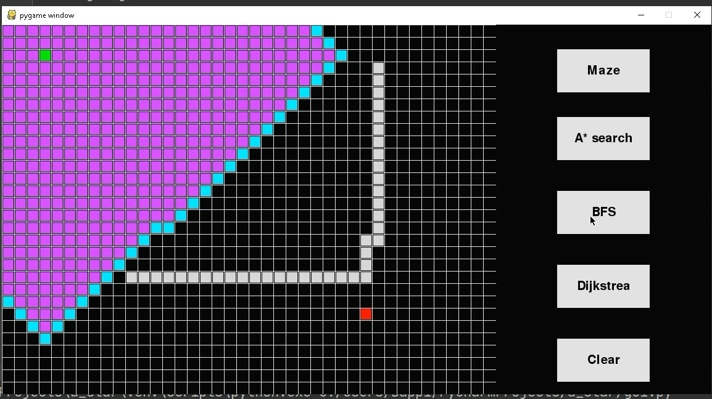

# Path-Finding-Algorithm-Visualization
path finding algorithm(BFS, Dijkstra,  A*) visualization using python-pygame

<h3> Feature </h3>
<h4> User can select start and gola node using left mouse button also can remove using right button</h4>

 
<h4>User also can drow barrier(wall) using mouse left button. and can remove it using mouse right button.</h4>

<h4>Algorithm can be run by button like BFS, Dijkstra, A star</h4>

